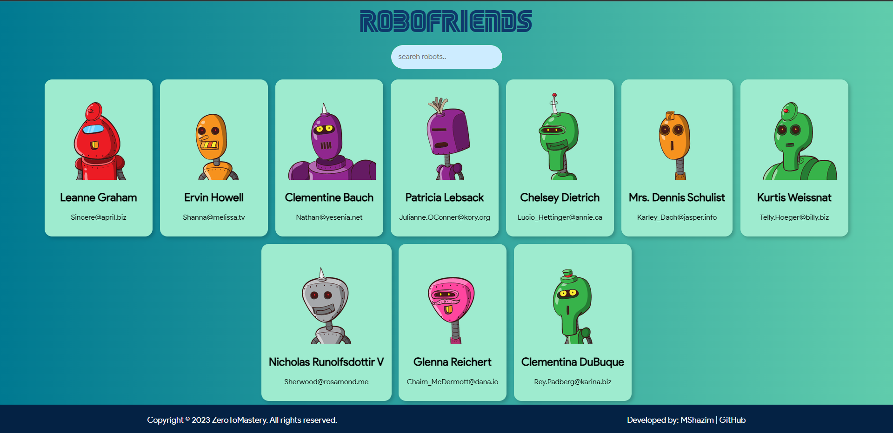

# RoboFriends

A responsive React application called RoboFriends, built with the Techyons library, that displays a collection of robot cards with their information. The app allows users to search and filter robots based on their names.



## Features

- Displays a collection of robot cards with their names, email addresses, and images.
- Allows users to search and filter robots by their names.
- Responsive design for optimal viewing on different devices.

## Technologies Used

- React
- Techyons
- HTML
- CSS
- JavaScript

## Getting Started

Follow the instructions below to get a local copy of the project up and running on your machine.

### Prerequisites

Make sure you have the following installed on your machine:

- Node.js (v14.0.0 or higher)
- npm (v6.0.0 or higher)

### Installation

1. Clone the repository:

   ```bash
   git clone https://github.com/MShazim/robofriends.git
   ```

2. Change to the project directory:

   ```bash
   cd robofriends
   ```

3. Install the dependencies:

   ```bash
   npm install
   ```

### Usage

1. Start the development server:

   ```bash
   npm start
   ```

2. Open the application in your browser:

   ```plaintext
   http://localhost:3000
   ```

3. Interact with the RoboFriends app and enjoy!

### Scripts

The following npm scripts are available:

- `npm start`: Starts the development server.
- `npm run build`: Builds the app for production.
- `npm run test`: Runs the tests.

## Contributing

Contributions are welcome! If you find any issues or have suggestions, please submit a pull request or open an issue on the GitHub repository.

## License

This project is licensed under the [MIT License](LICENSE).

## Contact

For any questions or inquiries, please contact [MShazim](mailto:aslamshazim20@gmail.com).

## Acknowledgements

- The RoboFriends app is inspired by the [Zero to Mastery](https://zerotomastery.io/) course.
- The Techyons library is developed by [Jxnblk](https://jxnblk.com/).
